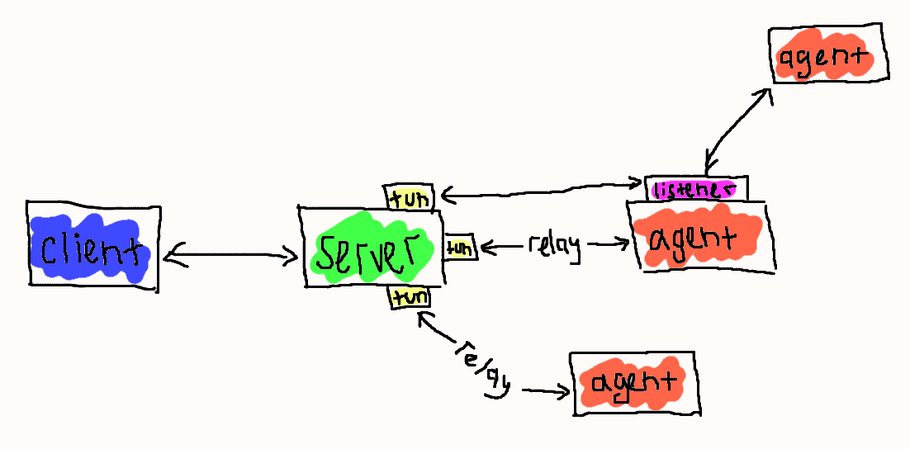

# Ligolo-mp : Tunneling like ligolo-ng, now with friends!


This thing is based on amazing work by [nicocha30](https://github.com/nicocha30) on [Ligolo-ng](https://github.com/nicocha30/ligolo-ng). I also borrowed quite a bit from [Sliver](https://github.com/BishopFox/sliver) codebase. Thanks, you people are amazing!

[](https://www.gnu.org/licenses/gpl-3.0)

## Table of Contents

<!-- START doctoc generated TOC please keep comment here to allow auto update -->
<!-- DON'T EDIT THIS SECTION, INSTEAD RE-RUN doctoc TO UPDATE -->

- [Introduction](#introduction)
- [Features](#features)
- [Important notes](#important-notes)
- [Terminology](#terminology)
- [Building](#building)
  - [Precompiled binaries](#precompiled-binaries)
  - [Building Ligolo-mp](#building-ligolo-mp)
- [Usage](#usage)
  - [Setup](#setup)
  - [Basic flow](#basic-flow)
  - [Accessing local ports](#accessing-local-ports)
  - [Chaining agents](#chaining-agents)
  - [Situational awareness](#situational-awareness)
  - [Misc](#misc)
- [Does it require Administrator/root access ?](#does-it-require-administratorroot-access-)
- [Caveats](#caveats)

<!-- END doctoc generated TOC please keep comment here to allow auto update -->

## Introduction

**Ligolo-mp** is a more specialized version of Ligolo-ng, with client-server architecture, enabling pentesters to play with multiple concurrent tunnels collaboratively. Also, with a sprinkle of less important bells and whistles.

## Features

Everything that you love about Ligolo-ng and:

- Multiplayer
- Multiple concurrent relays
- Routing to the loopback of target machine (no more port forwarding)
- Listeners are now independent redirectors
- Stricter agent liveness checks
- Built-in TUN management
- Dynamic mTLS-enabled agent binaries generation with obfuscation option
- Simplified certificate management

## Important notes

- This thing doesn't try to be stealthy: there are no tricky malleable profiles, no network fuckery - you will be detected. You have been warned.
- Server-side is linux-only (agents are still multi-platform, don't worry)
- Everything uses self-signed certs
- This is mostly just somehow slapped together, so use at your own risk

## Terminology

On our local machine we use *client* to connect to a *server*, that's running on the attacking machine. Then we run an *agent* on the machine we want pivot through - a target machine. To actually start pivoting, we create a *tun* and use it to start a *relay* between *server* and *agent*. We can also start a *listener* to, for example, chain connections through *agents* in cases where target machine can't directly reach our *server*.

Here's a very professional visual:



## Building

### Precompiled binaries

Precompiled binaries (Windows/Linux/macOS) are available on the [Release page](https://github.com/ttpreport/ligolo-mp/releases).

### Building Ligolo-mp

Just refer to the makefile, but just for completeness sake:

```shell
# Build server
$ make assets server

# Build client
$ make client

# Build everything
$ make all
```

## Usage

### Setup

TODO

### Basic flow

TODO

### Accessing local ports

TODO

### Chaining agents

TODO

### Misc

TODO

## Does it require Administrator/root access ?

On the *agent* side, no! Everything can be performed without administrative access.

However, on your the *server*, you need to be able to create/modify *tun* interfaces.


## Caveats

Because the *agent* is running without privileges, it's not possible to forward raw packets.
When you perform a NMAP SYN-SCAN, a TCP connect() is performed on the agent.

When using *nmap*, you should use `--unprivileged` or `-PE` to avoid false positives.

## TODO

- Client-server protocol: switch to something portable to make it possible to generate non-golang agents
- Install script: installs service
- Persistent TUNs (?)
- Unique certificate per generated agent binary for granular revocation