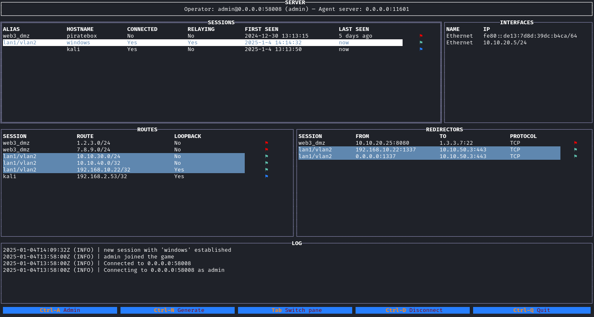

# Ligolo-MP : pivoting like a VPN, now with friends!

  

**Ligolo-MP** is an advanced version of Ligolo-ng, with client-server architecture, enabling pentesters to play with multiple concurrent tunnels collaboratively. It manages all your TUNs automatically, while also providing a clean GUI to track everything.

## Features

- Multiplayer
- Automatic TUN management
- Auto-restoring routing
- Unlimited concurrent relays
- SOCKS and HTTP proxy support (including SSPI/SPNEGO authentication)
- Cross-platform agent compatible with Linux/FreeBSD/MacOS/Windows 7+
- Routing to the loopback of target machine (no more port forwarding)
- Listeners are independent redirectors
- Dynamic mTLS-enabled agent binaries generation with obfuscation option
- Simplified certificate management
- Friendly terminal-based GUI

## Documentation

Please visit the [Wiki](https://github.com/ttpreport/ligolo-mp/wiki) for up-to-date information
